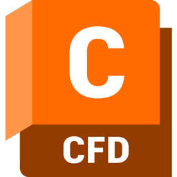

## 🤖 Jad Menkara - <a href ="https://jadmenkara.vercel.app/">Personal Website</a>

**`Professional Linkediner | Aspiring Biomedical Engineer | Incoming 11th Year HS Student`**
<!--
**Toyotra/Toyotra** is a ✨ _special_ ✨ repository because its `README.md` (this file) appears on your GitHub profile.

Here are some ideas to get you started:

- 🔭 I’m currently working on ...
- 🌱 I’m currently learning ...
- 👯 I’m looking to collaborate on ...
- 🤔 I’m looking for help with ...
- 💬 Ask me about ...
- 📫 How to reach me: ...
- 😄 Pronouns: ...
- ⚡ Fun fact: ...
-->

<h2>About Me</h2>

Hey there! My name is Jad Menkara. I am an incoming 11th grade student at Vincent Massey Secondary School with a passion for engineering and design. I primarily focus on mechanical and electrical engineering and am currently learning web-development to assist me on my tech journey. I have worked on various projects in the past like my <a href ="https://www.linkedin.com/posts/dorothy-zheng07_this-weekend-jad-menkara-and-i-competed-in-activity-7177809048770150400-L_4d?utm_source=share&utm_medium=member_desktop">Transhumeral Bionic Prosthesis</a> that I made for our regional science fair in March of 2024, and my Nerf Gun w/Computer Vision that I made in association with our local Hack Club. I am currently president of Vincent Massey Hack Club and the Vincent Massey Game Jam, and do various other extracurriculars. I also love to play guitar and have been playing for over three years now.

 

---
### 💻 Languages

    
    
    
    
    
    
    
    

 

### 👨‍💻 Software
<!--cura logo.png-->

